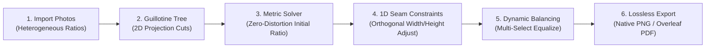

# Slide Collage Studio 🖼️📐

> **Zero-Distortion, Constraint-Driven Dynamic Photo Collage Engine for Presentations (PPT, Keynote) & Academic Papers (LaTeX / Overleaf).**

[](LICENSE)
[](https://pages.github.com/)
[]()
[]()
[]()

---

## 🌟 Overview

Arranging multiple heterogeneous images (portrait $9:16$, landscape $16:9$, square $1:1$) onto presentation slides or academic papers usually results in awkward manual resizing, distorted aspect ratios, or wasted whitespace.

**Slide Collage Studio** is a pure client-side web application designed to solve this problem mathematically. Powered by a **Recursive Guillotine Partition Tree** and **Strict 1D Orthogonal Constraints**, it allows you to compose multi-photo layouts with zero distortion, adjust seam proportions effortlessly, and export to **lossless full-resolution PNG** (with alpha transparency) or **tightly-bounded vector PDF** ready for Overleaf LaTeX.



---

## ✨ Key Features

### 🧩 1. Zero-Distortion Guillotine Layout
* **Automatic 2D Projection Cut**: Identifies natural topological dividers without slicing across photos, adapting to layouts like *1-Left / 2-Right*, *2-Left / 1-Right*, or *4-Grid*.
* **Aspect Ratio Metric Solver**: Solves the global aspect ratio from the leaves up to the root, guaranteeing that the initial layout requires **zero cropping** and causes **zero image squishing**.

### 📏 2. Strict 1D Orthogonal Seam Dragging
* **Vertical Seams (Blue Line)**: Dragging left/right adjusts neighboring column widths independently; vertical row heights are completely locked.
* **Horizontal Seams**: Dragging up/down adjusts row heights while column boundaries remain locked.
* **Adaptive Boundary Grips**: Drag canvas handles (right, bottom, corner) to scale canvas bounds while child tiles automatically adjust proportionally.

### ⚖️ 3. Multi-Select & Perceptual Balancing
* Multi-select photos using `Shift` or `Ctrl` to reveal a floating action toolbar.
* **⬌ Equal Width**: Dynamically computes partition ratios to allocate identical widths to selected items in parallel columns. If items span across different hierarchy levels, it automatically restructures them into a clean vertical column.
* **⬍ Equal Height**: Equates row heights for parallel items, or restructures cross-level photos into a unified horizontal row.
* **Batch Delete**: Remove all selected photos at once or hit the `Delete` key.

### 🔍 4. Independent Per-Photo Zoom & Pan
* **Mouse Wheel Zoom ($100\% - 400\%$)**: Hover over any individual tile and scroll the wheel to zoom into details with a live HUD badge (e.g., `🔍 130%`).
* **Micro-Pan**: Drag inside any photo to adjust visual focal points. Drag friction dynamically scales with zoom level to maintain pinpoint precision.
* **Double-Click Reset**: Double-click any photo (or use the right-click menu) to instantly reset zoom to $100\%$ and center the focal point.

### 🖼️ 5. Lossless Native Resolution Dynamic Export
* **No Artificial Resolution Cap**: Unlike conventional tools that downscale outputs to a fixed 1080p or 2400px canvas, the **Native Resolution Solver** dynamically calculates output dimensions based on the original pixel density of the smallest or dominant photo (supporting 4K, 8K, and 24MP+ images).
* **Live MP & Dimensions Counter**: The sidebar provides a real-time pixel counter and estimated megapixel readout before export.
* **Flexible Resolution Modes**: Choose from *Native 1:1*, *4K UHD (3840px)*, *2K QHD (2560px)*, or *1080P FHD (1920px)*.

### 📄 6. Slide & Academic-Ready Exports
* **Transparent Alpha PNG**: Exports with genuine alpha channels (including rounded corners and gaps), seamlessly blending into PowerPoint, Keynote, or dark-mode slides.
* **Overleaf / LaTeX Friendly PDF**: Generates tightly bounded, vector-framed PDFs with exact bounding boxes, requiring zero manual cropping in academic papers.

### 🔒 7. 100% Client-Side & Private
* **Zero Server Uploads**: All image decodes, canvas transformations, and file generations occur directly inside your browser's memory.
* **Instant & Offline**: Operates completely offline without an internet connection once cached.

### 🌐 8. Sleek Figma-Inspired UI & Bilingual Toggle
* Distraction-free, minimal aesthetic with zero cluttered paragraphs.
* **One-Click Language Switch**: Click `🌐 繁中 / English` in the top navigation bar to toggle between concise English and Traditional Chinese at any time.

---

## 🚀 Live Demo & Getting Started

### 🌐 Try It Live
You can deploy this repository to **GitHub Pages** with one click.
Once enabled, your live site will be accessible at:
```text
https://<your-username>.github.io/<your-repository-name>/
```

### 💻 Run Locally (No Installation Needed)
Because this project is built as a single, self-contained HTML5 application, no Node.js, Python, or build step is required:

1. Clone or download this repository:
   ```bash
   git clone https://github.com/<your-username>/slide-collage-studio.git
   cd slide-collage-studio
   ```
2. Double-click [`index.html`](index.html) to open it directly in any modern browser (Google Chrome, Microsoft Edge, Mozilla Firefox, Safari).

*Optional: Run via a lightweight local server:*
```bash
# Using Python
python -m http.server 8000

# Or using Node.js
npx serve .
```

---

## 📑 LaTeX / Overleaf Integration

When writing research papers or reports in LaTeX, export your collage as a **PDF**, upload it to your Overleaf project root, and include it directly:

```latex
\begin{figure}[htbp]
  \centering
  \includegraphics[width=\linewidth]{slide_collage.pdf}
  \caption{Multi-image comparative overview generated via Slide Collage Studio.}
  \label{fig:multi_comparison}
\end{figure}
```
*Because the PDF output is cropped to the exact outer bounding box, you will not encounter unnecessary white margins or misaligned captions.*

---

## ⌨️ Shortcuts & Controls

| Shortcut / Action | Function |
| :--- | :--- |
| **Mouse Wheel** | Zoom in / out on hovered photo ($100\% \sim 400\%$) |
| **Double-Click** | Reset zoom to $100\%$ and re-center image focus |
| **Click + Drag Photo** | Pan photo focal point inside tile (adaptive friction) |
| **Drag Blue Seams** | Adjust 1D orthogonal column widths or row heights |
| **Shift / Ctrl + Click** | Multi-select multiple photos across canvas or pool |
| **Del / Backspace** | Delete selected photo(s) |
| **Right-Click** | Context menu (Rotate 90°, Replace, Delete, Reset Pan) |
| **Esc** | Close modals, context menu, or clear selections |

---

## 📂 Project Structure

```text
slide-collage-studio/
├── index.html         # Complete single-file application (UI, Canvas, Engine, Export)
├── README.md          # Project documentation (this file)
├── FEATURES.md        # Comprehensive feature documentation & user manual
├── PRINCIPLES.md      # Mathematical formulations, tree topology & solver architecture
├── LICENSE            # MIT License
└── .gitignore         # Excludes local test media, PDFs, and backup files
```

---

## 🛠️ Architecture & Core Principles

For detailed mathematical explanations and layout algorithms:
* Read [`PRINCIPLES.md`](PRINCIPLES.md) to learn how the **Recursive Guillotine Binary Tree**, **1D Orthogonal Constraints**, and **Dynamic Native Resolution Back-propagation** work under the hood.
* Read [`FEATURES.md`](FEATURES.md) for step-by-step user tutorials and edge-case handling.

---

## 📄 License

This project is licensed under the [MIT License](LICENSE). You are free to use, modify, and distribute it for both personal and commercial slide decks, academic publications, or web integrations.
