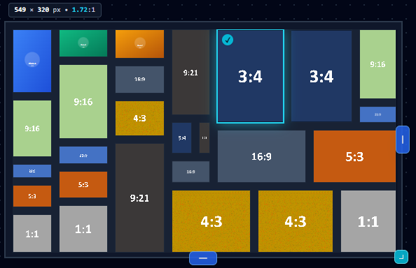

# Slide Collage Studio
Constraint-driven photo collage generator for slides and research papers with zero aspect ratio distortion.  
*Vibe coded with Google Antigravity & Gemini 3.8 Flash.*

[License: MIT](LICENSE) | [Live Demo on GitHub Pages](https://huangbugwei.github.io/slide-collage-studio/)

### Demo

  <video src="https://github.com/user-attachments/assets/1077acff-1c1d-49a7-be4d-babad404d623" width="85%" controls></video>

  

### Problem Solved
Arranging multiple heterogeneous images (portrait 9:16, landscape 16:9, square 1:1) onto presentation slides (PowerPoint / Keynote) or LaTeX papers usually requires tedious manual cropping, stretched aspect ratios, or awkward empty margins.

Slide Collage Studio solves this by using a **Recursive Guillotine Partition Tree**:
1. Automatically identifies 2D projection cut seams between photos without slicing through image contents.
2. Solves the global aspect ratio bottom-up from leaf nodes, matching the layout to native photo ratios with 0 initial cropping.
3. Enforces strict 1D orthogonal seam adjustments (vertical seams only adjust column widths; horizontal seams only adjust row heights).

### Mouse Functions
* **Wheel**: Zoom in / out on hovered photo (1.0x – 4.0x)
* **Left-click + Drag (inside cell)**: Pan focal point of the image (adaptive friction)
* **Left-click + Drag (blue seams)**: Adjust 1D orthogonal column widths or row heights
* **Left-click + Drag (canvas handles)**: Resize overall canvas boundary
* **Double-click**: Reset zoom to 1.0x and center the focal point
* **Right-click**: Context menu (Rotate 90°, Replace, Delete, Reset Pan)

### Hot Keys
* <kbd>Shift</kbd> / <kbd>Ctrl</kbd> + Click: Multi-select photos across canvas or photo pool
* <kbd>Delete</kbd> / <kbd>Backspace</kbd>: Delete selected photo(s)
* <kbd>M</kbd>: Toggle corner Viewport Minimap on / off
* <kbd>C</kbd>: Toggle Crop HUD (badges and edge warning lines)
* <kbd>Esc</kbd>: Clear selection or dismiss modals / context menu

### Main Features
* **Zero-Distortion Guillotine Layout**: Resolves heterogeneous aspect ratios without squishing.
* **Strict 1D Orthogonal Constraints**: Vertical dividers lock row heights; horizontal dividers lock column widths.
* **Multi-Select Alignment**:
  * `Equal Width`: Balances column widths across parallel photos.
  * `Equal Height`: Balances row heights across parallel photos.
* **Crop Inspection**:
  * Visual badge displays visible area percentage (`92% vis` or `100% full`).
  * Subtle edge lines indicate whether top/bottom or left/right are cropped.
  * Panning/zooming temporarily reveals a ghost bounding box showing the full uncropped image.
  * Optional corner minimap for navigation when zoomed.
* **Lossless Native Resolution Export**: Dynamically calculates canvas dimensions based on original image pixel densities (supporting 4K, 8K, 24MP+) instead of downscaling to fixed 1080p.
* **Slide & Academic Exports**:
  * PNG with real alpha transparency for slide backgrounds.
  * Vector PDF container for Overleaf / LaTeX (often renders and compiles faster than embedding heavy raster bitmaps; note: benchmark unverified).
* **Bilingual UI**: One-click toggle between English and Traditional Chinese in the top bar.

### Client-Side Execution & Privacy
* **100% Client-Side**: Hosted statically on GitHub Pages with no backend server, database, or analytics tracking.
* All image decoding, canvas manipulation, and export generation run strictly in browser RAM via HTML5 File & Canvas APIs. Photos never leave your machine.
* Fully functional offline once loaded.

### Acknowledgements
Vibe coded with [Google Antigravity](https://deepmind.google/) & Gemini 3.8 Flash.

### License
MIT License. See [LICENSE](LICENSE) for details.
